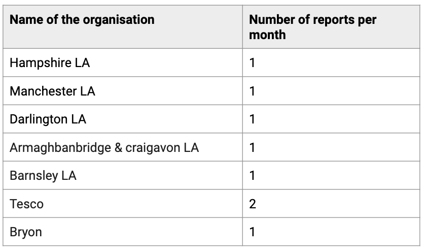
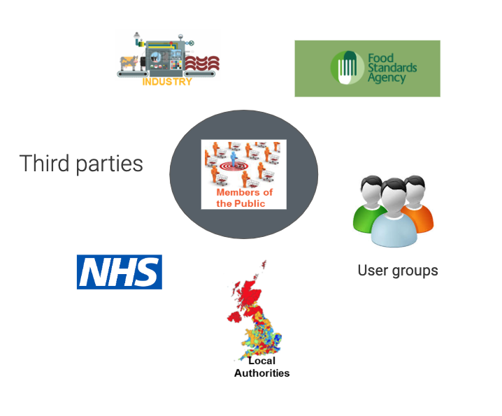

## Scale of the problem within the UK

* There are approximately 2 million people living with a diagnosed food allergy in the UK. 
* It affects 2% of adults and 8% of children. 
* Food hypersensitivity is responsible for approximately 27,000 hospitalisation days a year
* On average 10 people die each year in England and Wales from food allergy

(source: The Natasha Research Foundation, https://www.food.gov.uk/sites/default/files/media/document/fifth-csa-report-allergy%20(1).pdf)

However, there seems to be a mismatch between reporting volumes and the number incidents of allergic food reactions being formally reported. A sample based on research for this Discovery suggests reporting figures are low:

## Key user and stakeholder groups

There are a number of different players involved in potentially reporting allergic reactions to food and collecting associated data

 

## The role of the FSA regarding food allergens

* Act as a central competency authority - food safety authority
* Provide centralised coordination 
* Consistency across the board - operating the same way 
* FSA have no enforcement responsibility
