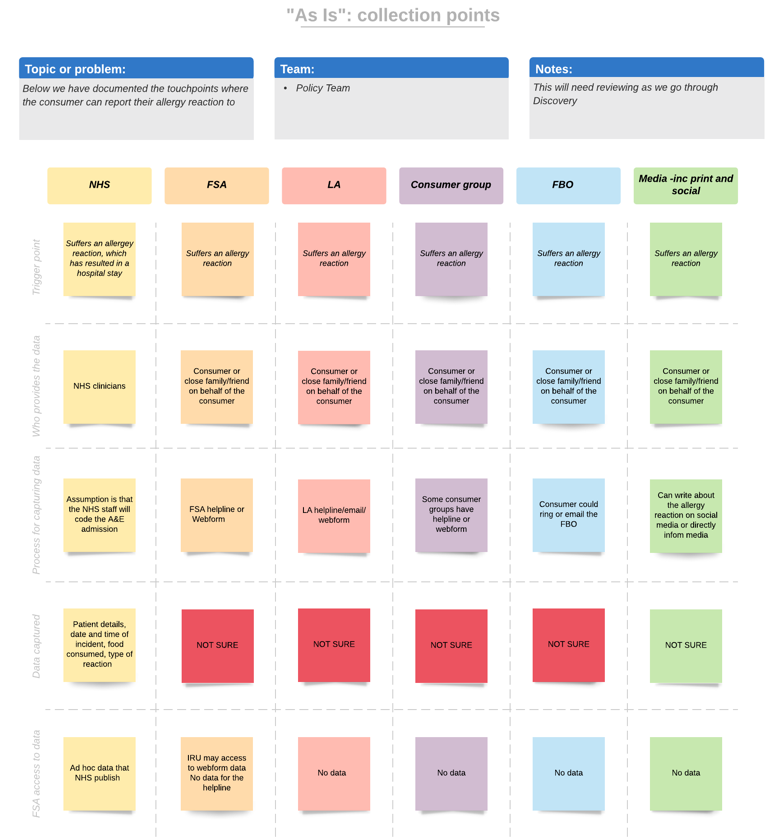
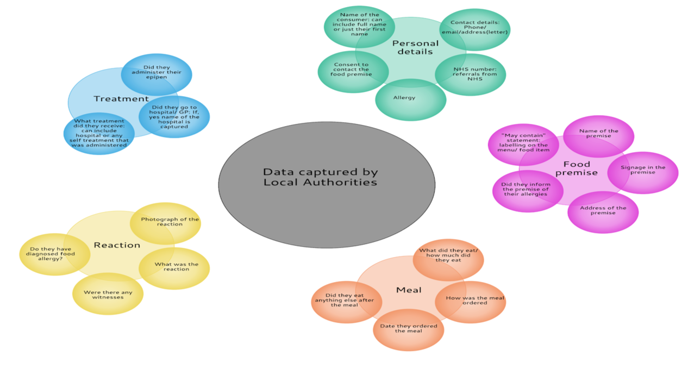

## Data collection points

The illustration below illustrates the different points where consumers can currently report their allergic reactions to food - both actual and/or narrowly avoided. 

It is worth noting that the FSA has minimal access to this data

## Data local authorities capture

