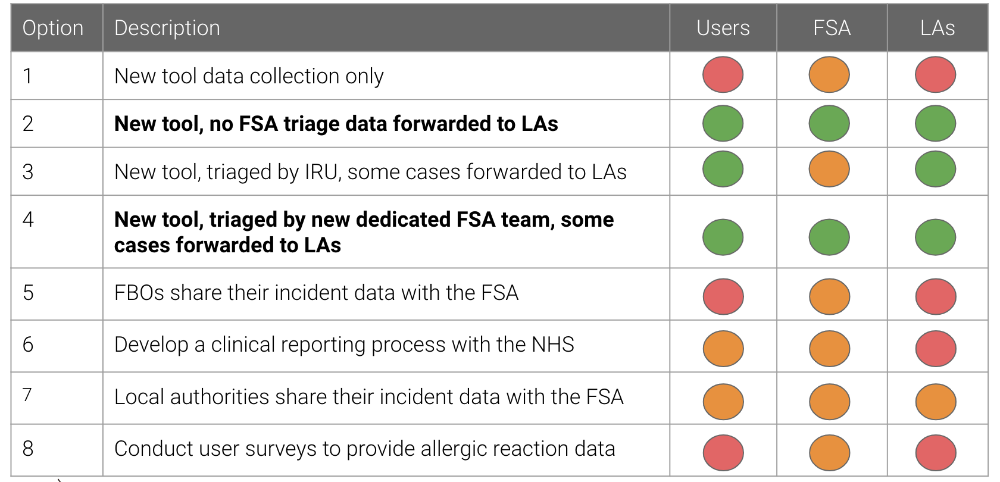

The full, RAG-rated results (with individual supporting commentary) for each of the eight options, can be downloaded [here](uploads/Impact_assessment_by_option.pdf)

* R = Needs were only marginally met/not at all
* A = Partially met
* G = Largely/fully met

The table below provides a summary of each one. 

