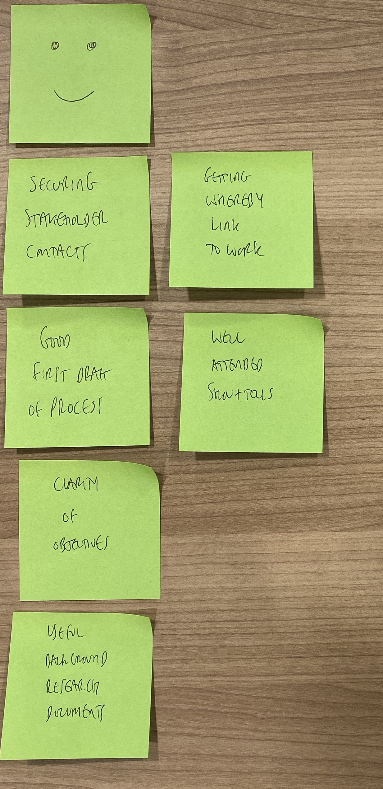
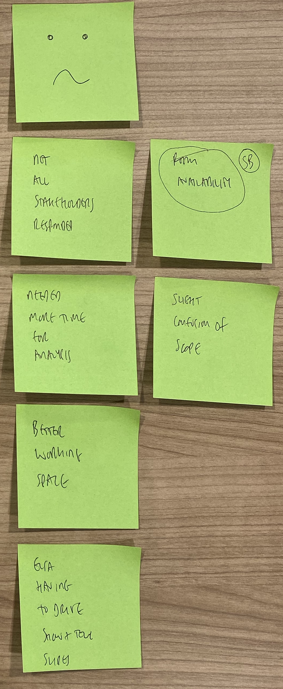
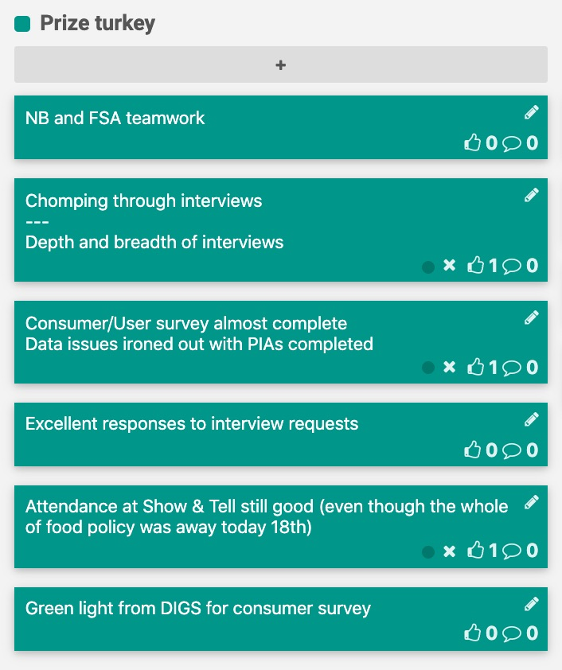
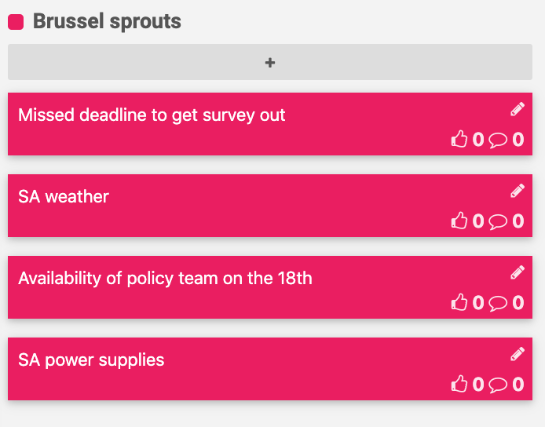
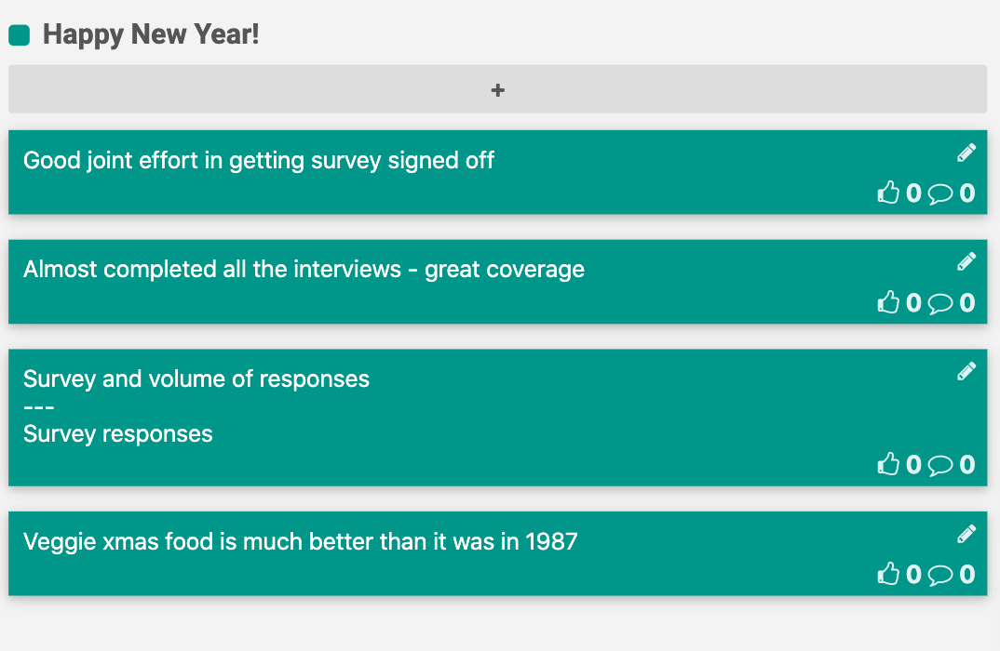
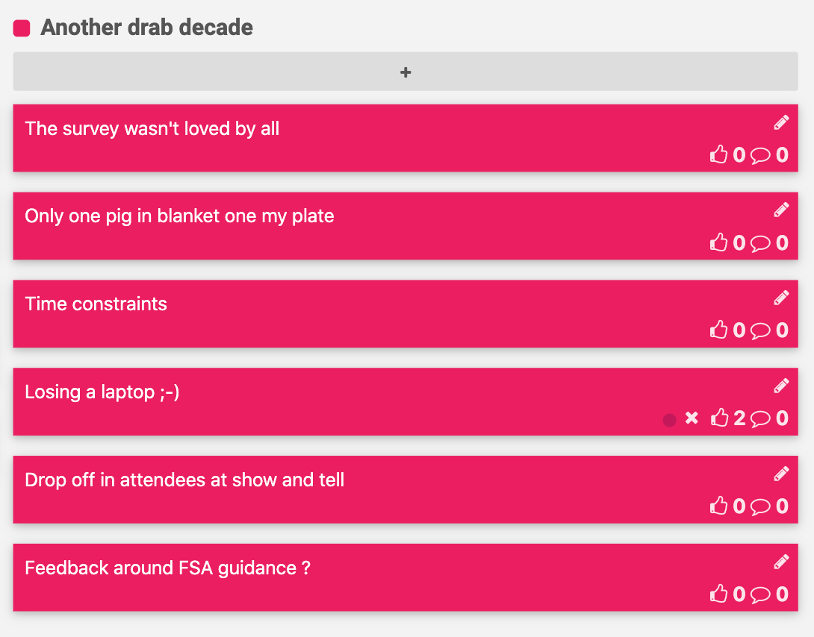
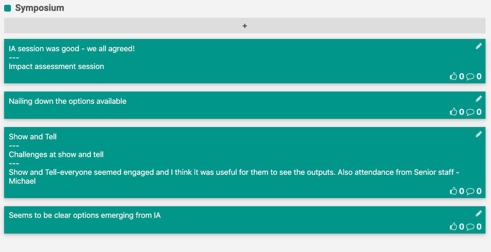
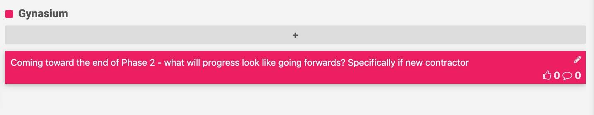
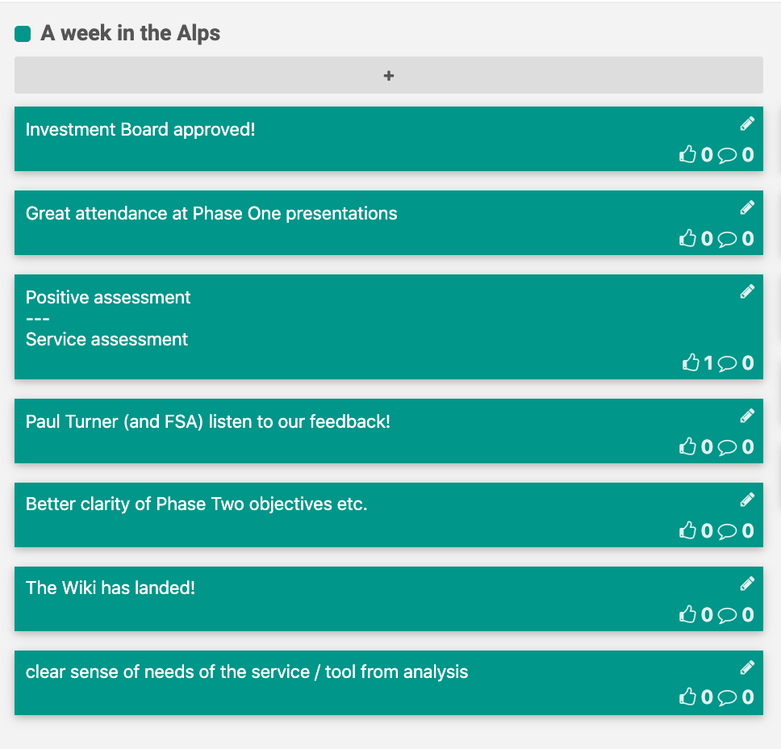
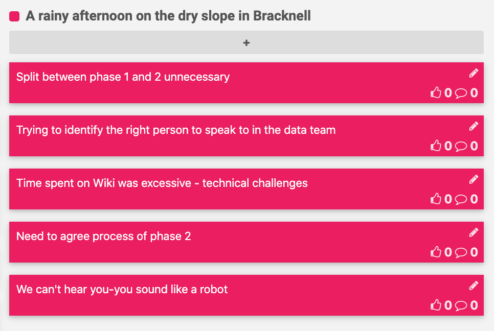

# Retrospectives

A retrospective is a ceremony held by an agile team at the end of each sprint to openly discuss what is going well and what needs improvement. It's a key activity to help the team iteratively improve their working culture.

[FunRetro](https://funretro.io/) is a great tool for disbursed teams.

# Discovery
## Sprint 1 (02/12/19 - 06/12/19)

### Happy

### Sad

## Sprint 2 (09/12/19 - 13/12/19)

### Happy

### Sad

## Sprint 3 (16/12/19 - 20/12/19)

### Happy

## Sprint 4 (06/01/20 - 10/01/20)

### Happy
 

### Sad

## Sprint 5 (13/01/20 - 18/01/20)

### Happy
 

### Sad

## Sprint 8 (03/02/20 - 07/02/20)

### Happy

### Sad

