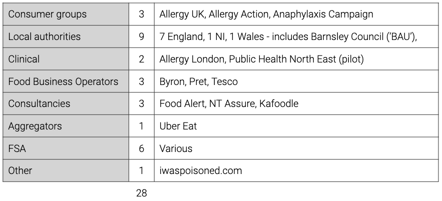

### Stakeholder interviews

During Phase One of the Discovery the team conducted 28 formal interviews with a variety of stakeholders. Each interview last approximately 60 mins and were conducted either face to face or by telephone.

### Discussion Guides

The Discovery team created a series of discussion guides for each of the stakeholder groups interviewed as part of the research. 

The discussion guides provide a framework of questions, broadly grouped by theme, that are relevant to the person and/or organisation being interviewed.

[Local Authority Discussion Guide](uploads/Local_Authority_Discussion_Guide.pdf)

[Living with an allergy Discussion Guide](uploads/Living_with_an_allergy_discussion_guide.pdf)

[UK Consumer Group Discussion Guide](uploads/UK_Consumer_Group_Discussion_Guide.pdf)