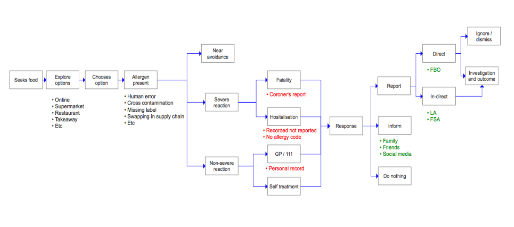

The diagram below is a high level summary of the potential routes that a person wishing to report an allergic reaction to food (actual or narrowly avoided) may experience. 

It is based upon user research undertaken for this Discovery. 

* Red text relates to collected data 
* Green text indicates to whom information relating to an allergic reaction is shared 

